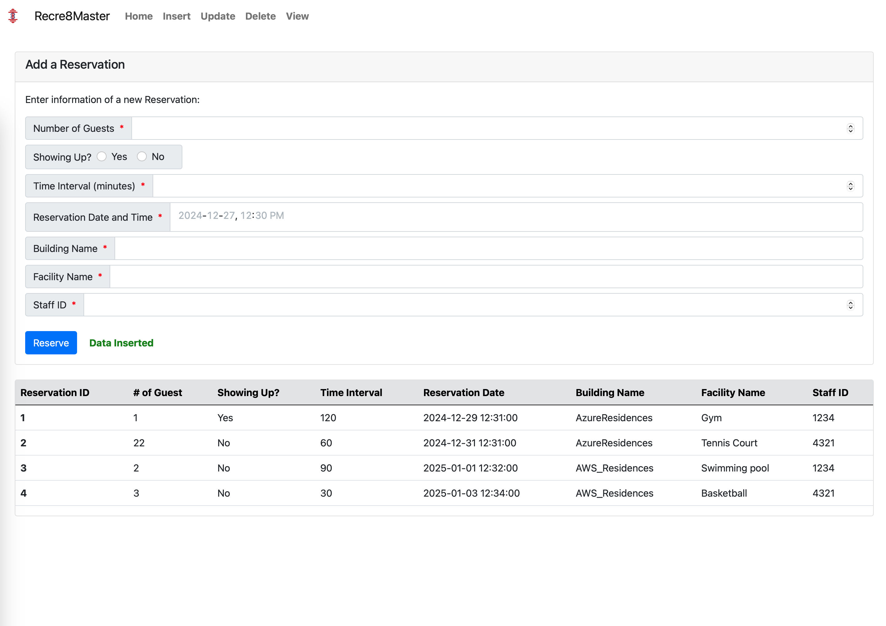
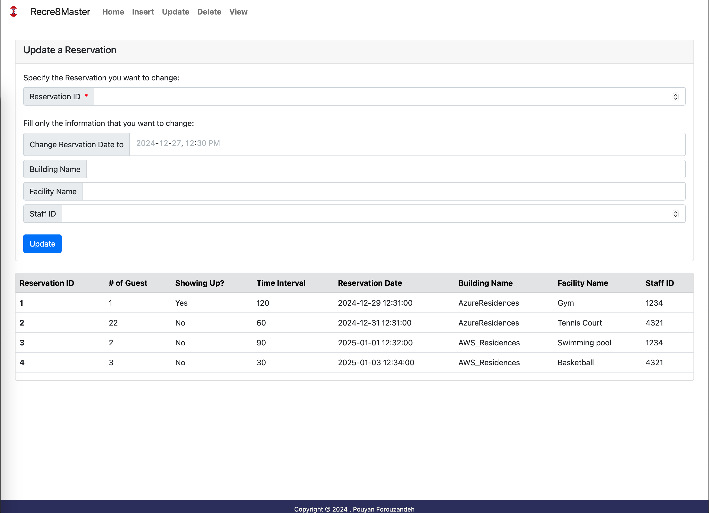
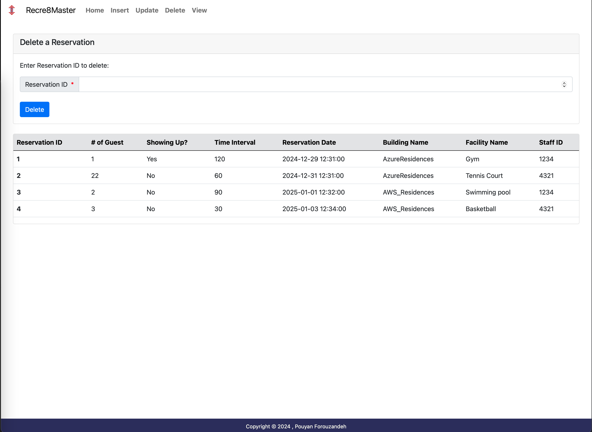
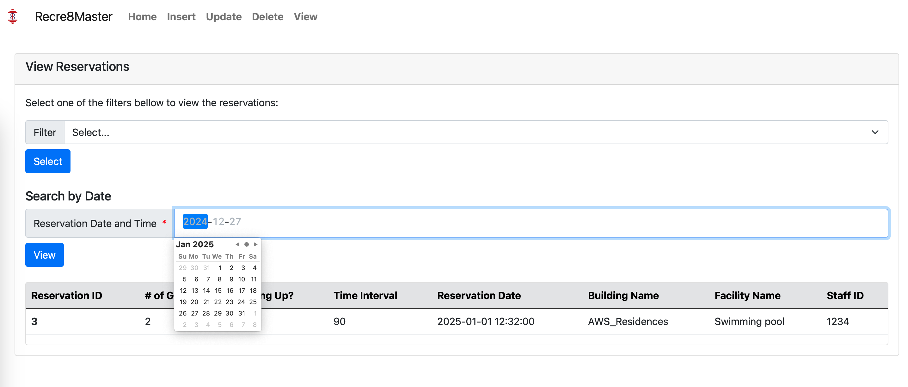
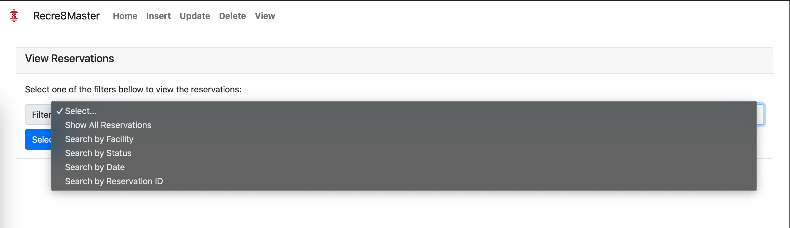
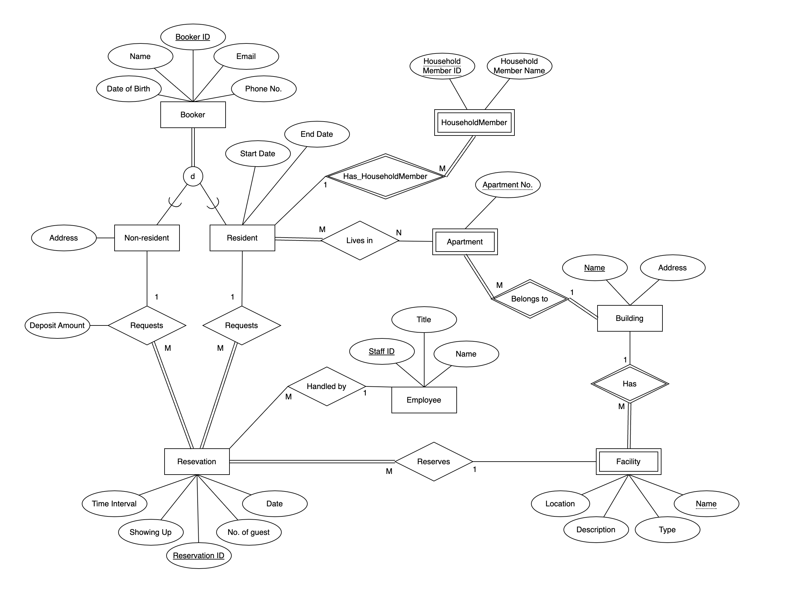

# Recre8Master  

Recre8Master is a database management system designed for managing high-rise housing complexes and their associated recreation facilities. With this system, you can efficiently handle tenant and non-resident reservations, manage employee records, and store details for buildings and recreation facilities like swimming pools, gyms, and tennis courts.

<p align="center">
  
</p>  

## Features  

- **Reservation Management**:  
  - Add, update, and delete reservations for recreation facilities.  
  - Store and manage tenant, non-resident, and employee information.  
- **Filtering and Searching**:  
  - Show all reservations.  
  - Search reservations by:  
    - Facility  
    - Status  
    - Date  
    - Reservation ID  

## Usage  

This system provides an easy-to-use interface to perform CRUD operations and search/filter data for better management of the housing complex facilities.  

## Demo  

<div style="display: flex; flex-wrap: wrap; gap: 10px; justify-content: center;">  
    
    
    
    
    
</div>  

## Database Relations  

Below is the diagram showing the relationships between entities:  

<p align="center">
  
</p>

## Technologies Used  

- **Language**: PHP  
- **Frontend Framework**: Bootstrap  
- **Database**: MS SQL Server 

## How to Run  

1. Clone this repository:  
   ```bash  
   git clone https://github.com/username/Recre8Master.git
   
2. Set up a local server (e.g., XAMPP, WAMP) and place the project folder in the server's root directory.

3. Access the project in your browser at http://localhost/Recre8Master.
